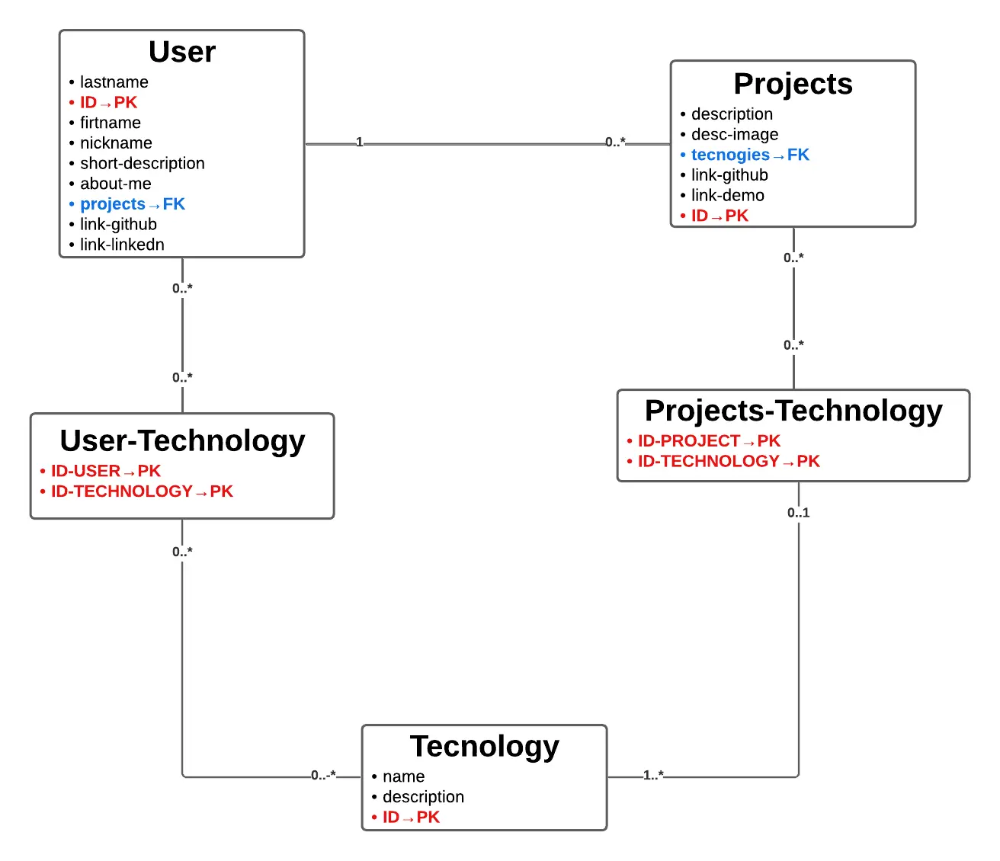

# Project: Portfolio

This project is a personal portfolio website built with Next.js, TypeScript, and Tailwind CSS.

The project architecture follows a feature-based folder pattern. The main goal is to showcase my skills, projects, and knowledge through a modern web application, applying industry best practices.

You can view the deployed site here:

`
https://roalp.vercel.app/
`

The project was deployed using an AWS S3 bucket. Additionally, a database was created to store the information displayed on the website.
For this purpose, I used Supabase as the database service.

While a database is not strictly necessary for a portfolio, I decided to include it to experiment with data persistence and to apply the knowledge acquired during my studies.

Below is the structure of the database used in the project:

